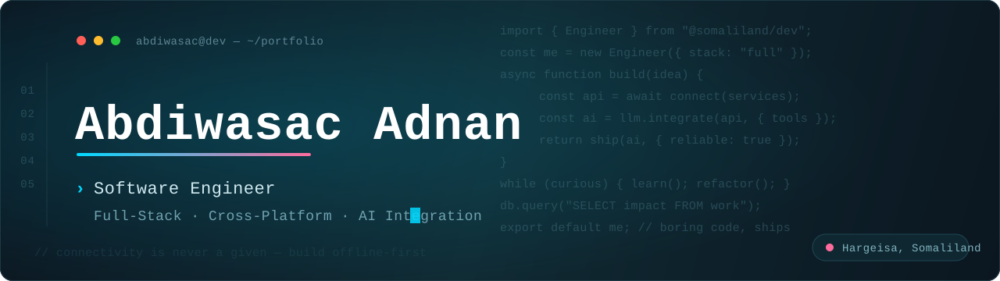
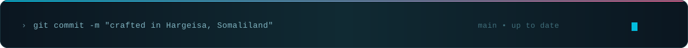

<!--
  Hi — you're reading the source. Good instinct.
  Reach me: hasanabdiwasac@gmail.com
-->

<!-- ═══════════════════════════ HERO ═══════════════════════════ -->

  

 

<!-- ═══════════════════════════ ABOUT ═══════════════════════════ -->

## About

I'm a software engineer who works across the full stack — backend services, web applications, and cross-platform mobile. Most of my time goes to backend architecture, system integration, and the unglamorous work of making different systems talk to each other correctly, including integrating AI and LLMs into real applications.

I'm driven by a single question on every project: *did this measurably make someone's work easier?* I'd rather ship boring, reliable code than clever code that never reaches production.

A lot of my own building is aimed at the Somaliland and Horn of Africa market — fintech and tooling designed around how people here actually transact, with mobile money and offline-first realities baked in from day one.

 

<!-- ═══════════════════════════ STACK ═══════════════════════════ -->

## Tech Stack

**Languages**

**Frontend & Mobile**

**Backend & Data**

&nbsp;

**Tooling & Infrastructure**

 

<!-- ═══════════════════════════ WHAT I DO ═══════════════════════════ -->

## What I Build

<table>
<tr>
<td width="50%" valign="top">

### Full-Stack Web

SEO-friendly, performant applications with **Next.js** on the frontend and **Node.js** or **Python** services behind them. From server components to API contracts, I build web apps that feel native and stay maintainable.

</td>
<td width="50%" valign="top">

### Cross-Platform Mobile

Native-quality apps for iOS and Android using **React Native** and **.NET MAUI** — with offline-first storage and reliable sync, because connectivity here is never a given.

</td>
</tr>
<tr>
<td width="50%" valign="top">

### Backend & Data

Systems designed to scale gracefully. **SQL Server** where I need ACID guarantees, **MongoDB** where I need flexibility, and a focus on schema design, indexing, and clean API boundaries over shortcuts.

</td>
<td width="50%" valign="top">

### Fintech & Emerging Markets

Products for the Horn of Africa — digitizing mobile-money workflows and traditional savings systems for a market that's underserved by global platforms, built with the local infrastructure constraints in mind.

</td>
</tr>
<tr>
<td width="50%" valign="top">

### AI Integration

Bringing LLMs into real systems — wiring up APIs, structured outputs, tool use, and retrieval so AI becomes a dependable feature inside an application rather than a demo. I focus on making it accurate, controllable, and production-ready.

</td>
<td width="50%" valign="top">

### Backend Integration

Connecting systems that weren't built to talk to each other — APIs, third-party services, and data pipelines — with attention to error handling, idempotency, and the edge cases that break sync in production.

</td>
</tr>
</table>

 

<!-- ═══════════════════════════ STATS ═══════════════════════════ -->

## GitHub Activity

  

  

 

<!-- ═══════════════════════════ PRINCIPLES ═══════════════════════════ -->

## How I Work

- **Make it work, then right, then fast** — in that order, every time.
- **Boring code is good code.** Save the cleverness for architecture, not syntax.
- **Code is read far more than it's written.** I optimize for the next person — usually a future version of me.
- **Shipped beats perfect.** A v1 in production teaches more than a v3 in my head.
- **Trust the tests, not the vibes.**

 

<!-- ═══════════════════════════ CONTACT ═══════════════════════════ -->

## Let's Connect

I'm open to freelance work, open-source collaboration, and conversations about fintech, backend architecture, or building for emerging markets.

 

Open to freelance work, OSS collaboration, and conversations about backend, fintech, and AI.

